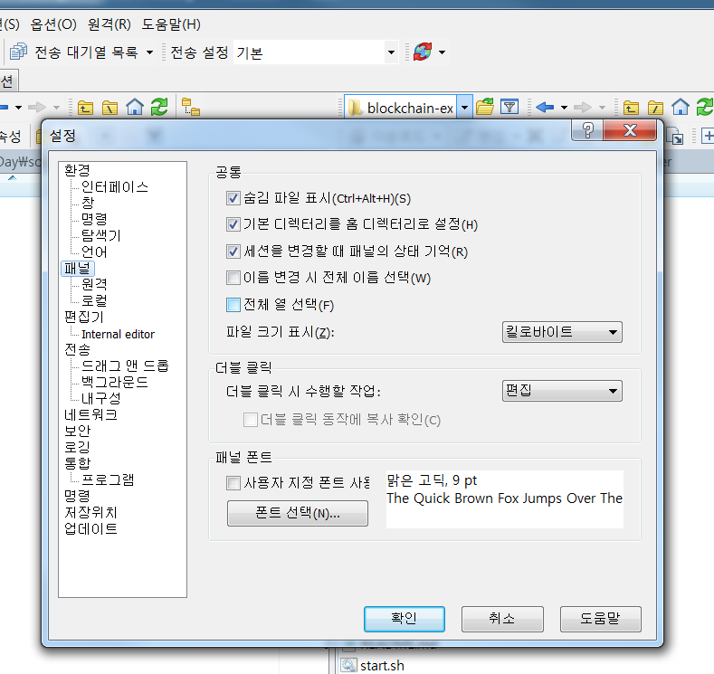

# IBM Blockchain Experience Day  
  
  
## 실습1 : Hyperledger Fabric 시작하기  
********
  
## 실습 목표
본 실습은 Hyperledger Fabric 을 이용하여 블록체인 네트워크 환경을 구성하고 샘플 네트워크를 동작시키는 과정을 단계별로 알아봅니다. Hyperledger Fabric은 Linux Foundation산하의 open source 프로젝트로서 분산 원장 기술을 전 산업에 걸쳐 표준화하고 발전시키려는 목적으로 개발되고 있습니다.  


## 사전 준비사항  
본 실습은 Linux OS 중의 하나인 Ubuntu에서 Docker Container 기반으로 진행됩니다. 실습을 위해서는 다음과 같은 환경의 준비가 필요합니다.  
* 물리적 혹은 가상화된 서버
* 2 Core 이상의 CPU
* 8GB 이상의 Memory
* 64GB 이상의 Disk 용량

  
## 기본 환경 구성
본 실습을 위해서는 다음과 같은 소프트웨어가 사전에 설치되어야 합니다.  
* Node.js (v8.9.4)
* npm (v5.6.0)
* Docker (v17.12.0-ce)
* Docker Compose (v1.13.0)
* Python (v2.7.12)  


괄호 안의 버전은 본 실습이 테스트 된 환경입니다. 그 외 다른 버전으로도 가능할 수 있으나 원활한 실습을 위해서 해당 버전을 인스톨 하는 것을 권장합니다.  
원격 접속 터미널 도구(Putty) 를 통해 제공된 리눅스 서버에 접속하여 아래의 명령을 실행하도록 하겠습니다.  
아래와 같이 curl을 통해 스크립트를 다운로드하고 실행하면 필요한 소프트웨어를 한번에 설치합니다.  
  
```
cd ~
sudo apt-get update
curl -O https://hyperledger.github.io/composer/latest/prereqs-ubuntu.sh
chmod u+x prereqs-ubuntu.sh
./prereqs-ubuntu.sh
```
  
추가로 docker-compose를 설치합니다.
```
sudo apt-get install docker-compose
```
  
**설치가 완료되면 터미널을 닫고 다시 로그인합니다.**  


## Hyperledger Fabric 설치  
본 실습에서는 Hyperledger Fabric 1.0.6 버전을 이용합니다. 1.0.6 버전은 Hyperledger Fabric 1.1 버전 이전의 마지막 release로서 교재 작성일 현재 최신의 안정화된 버전입니다.  
  
다음의 명령을 통하여 Hyperledger Fabric 1.0.6 바이너리와 Docker 이미지들을 다운로드합니다.  
```
mkdir fabric-binaries
cd fabric-binaries
curl -sSL https://goo.gl/6wtTN5 | bash -s 1.0.6
```
  
Hyperledger Fabric 명령을 보다 간편하게 수행하기 위해서 .profile 파일에 다운로드한 binary 폴더를 PATH로 추가합니다. 우선 vi 에디터로 .profile 파일을 오픈합니다.  
```
cd ~
sudo vi .profile
```
  
.profile 파일의 가장 끝에 아래와 같은 코드를 추가합니다.  
```
export PATH=~/fabric-binaries/fabric-samples/bin:$PATH
```
  
> vi 에디터를 편집하기 위해서는 'i' 키를 입력합니다.  
> vi 에디터에서 편집된 데이터를 저장하고 나가려면 esc키를 누르고 'wq'를 입력합니다.
  
변경사항을 적용하기 위하여 다음의 명령을 수행합니다.  
```
source .profile
```
  
이제 Hyperledger Fabric을 시작하기 위한 구성파일을 준비합니다. 우선 홈디렉토리 하위에 blockchain-demo 디렉토리를 생성합니다. 그리고 그 하위에 local-hyperledger 폴더를 생성합니다. *(본 실습 환경에서는 이미 디렉토리가 생성되어 있습니다.)*  
```
mkdir blockchain-demo
cd blockchain-demo
mkdir local-hyperledger
```
Lab01 교재와 같은 폴더에 들어있는 local-hyperledger.zip 파일의 압축을 풀어 포함된 파일들을 local-hyperledger 폴더에 복사합니다. *(본 실습 환경에서는 이미 파일들이 복사되어 있습니다.)*  
압축파일에 포함된 파일들은 아래와 같습니다.  
* channel-artifacts (디렉토리)
* crypto-config (디렉토리)
* configtx.yaml
* crypto-config.yaml
* docker-compose.yaml


local-hyperledger 폴더에 포함된 파일들을 살펴봅니다.  
configtx.yaml 파일은 블록체인 네트워크의 채널과 조직에 관련된 설정을 담고 있습니다.  
  
  

crypto-config.yaml 파일은 Orderer와 Peer의 사용자 인증서를 생성하기 위한 설정 파일입니다.  
  
  

마지막으로 docker-compose.yml 파일은 Docker Compose를 이용하여 여러 컨테이너를 동시에 관리하기 위해 사용되는 설정파일로 peer, orderer, ca 등의 컴포넌트들이 컨테이너로 기동되어 블록체인 네트워크를 구성할 수 있도록 정의합니다.  
  
  

## Hyperledger Fabric 구동을 위한 artifact 생성  
Hyperledger Fabric을 구성하기 위해서는 관련된 artifact들을 먼저 생성해야 합니다.  

우선 블록체인 네트워크에서 사용되는 관리자와 사용자의 인증서를 생성하도록 하겠습니다. 인증서 생성에 필요한 설정은 crypto-config.yaml 파일에 정의되어 있습니다. 앞서 바이너리로 다운받은 bin 폴더 내의 cryptogen 명령어를 실행시켜 인증서를 생성합니다. 이미 path를 설정하였으므로 경로를 명시하지 않고 명령을 실행할 수 있습니다.  
```
cd ~/blockchain-demo/local-hyperledger
cryptogen generate --config=./crypto-config.yaml
```
본 실습에서는 1개의 조직만으로 네트워크를 구성하고 있으므로 org1에 대한 인증서만이 생성됩니다. 생성된 인증서는 현재 디렉토리 하위의 crypto-config라는 폴더에 저장됩니다.  
   
다음은 최초에 생성되는 블록인 genesis 블록과 channel 관련 정보를 생성합니다. configtxgen 명령은 블록체인 시작에 필요한 artifact들을 생성하는 명령입니다. 이 명령은 configtx.yaml 파일에 설정된 채널과 조직에 기반하여 artifact들을 생성합니다.  
  
  
configtx.yaml 파일이 현재의 경로에 있으므로 해당 경로를 FABRIC_CFG_PATH에 설정한 후 genesis 블록을 생성합니다. 여기서 생성되는 블록 파일은 블록체인에서 최초 블록의 역할을 하게 됩니다.

```
export FABRIC_CFG_PATH=$PWD
configtxgen -profile ComposerOrdererGenesis -outputBlock ./channel-artifacts/genesis.block
```

생성된 파일은 현재 디렉토리 하위의 channel-artifacts폴더에 저장됩니다.  
다음은 아래의 명령으로 채널 구성에 필요한 artifact를 생성합니다.  
```
$ export CHANNEL_NAME=composerchannel
$ configtxgen -profile ComposerChannel -outputCreateChannelTx ./channel-artifacts/composer-channel.tx -channelID $CHANNEL_NAME
```
  
위 명령은 채널 이름을 composerchannel로 하고channel-artifacts 폴더 내에 composer-channel.tx라는 이름으로 채널 configuration 파일을 생성합니다. 여기에 이용되는 ComposerChannel 프로파일은 configtx.yaml에 정의되어 있습니다.  
향후 채널 내에서 발생할 transaction의 전파 기준이 될 Anchor peer를 정의합니다. Anchor peer는 peer간의 통신에서 메시지를 중계해주는 peer의 역할을 하게 될 것입니다.  
```
$ configtxgen -profile ComposerChannel -outputAnchorPeersUpdate ./channel-artifacts/Org1MSPanchors.tx -channelID $CHANNEL_NAME -asOrg Org1
```
  
## Hyperledger Fabric 네트워크 시작
docker-compose를 이용하면 필요한 모든 컨테이너들을 한번에 실행할 수 있습니다. docker-compose를 실행하기 위한 모든 설정은 docker-compose.yml에 정의되어 있습니다. 우선 에디터를 열어 docker-compose.yml 파일을 자신의 환경에 맞게 편집해야 합니다. 여기서는 CA (Certificate Authority)에서 사용하는 key file의 경로만 수정하면 되도록 구성하였습니다.  
WinSCP를 이용해 서버의 ~/blockchain-demo/local-hyperledger 경로에 위치한 docker-compose.yml을 다운받은 후에 편집기(Atom)에서 오픈합니다.  

#### WinSCP 설정 팁
> WinSCP의 기본 설정은 .으로 시작하는 디렉토리가 보이지 않습니다. 차후 실습을 위해 이를 보이게 하는 설정을 하는것이 좋습니다.  
> 옵션 > 설정 > 좌측탭의 패널 > 숨김 파일 표시에 체크를 하면 됩니다.  
  
  
파일 상단의 services 하위 ca.org1.example.com 하위의 environment 설정에서 FABRIC_CA_SERVER_CA_KEYFILE 의 값을 수정합니다. 맨 끝에 xxx_sk 라고 되어 있는 파일명을 다음의 경로에 존재하는 파일명으로 변경합니다.  
파일경로: ~/blockchain-demo/local-hyperledger/crypto-config/peerOrganizations/org1.example.com/ca


