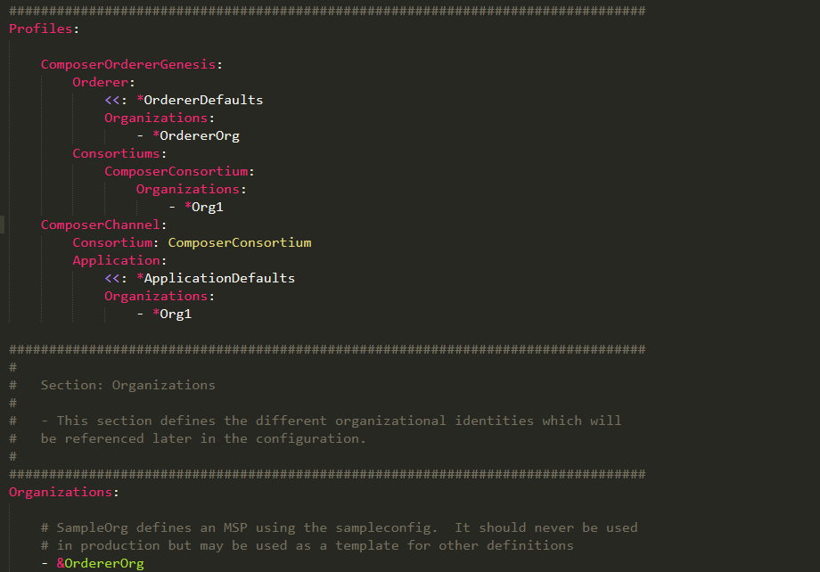
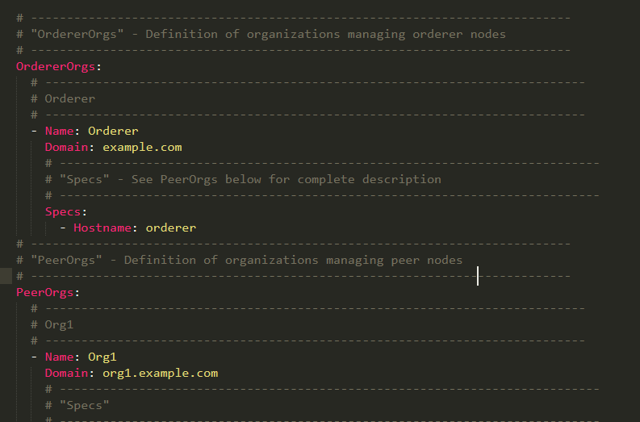

# IBM Blockchain Experience Day  
  
  
## 실습1 : Hyperledger Fabric 시작하기  
********
  
## 실습 목표
본 실습은 Hyperledger Fabric 을 이용하여 블록체인 네트워크 환경을 구성하고 샘플 네트워크를 동작시키는 과정을 단계별로 알아봅니다. Hyperledger Fabric은 Linux Foundation산하의 open source 프로젝트로서 분산 원장 기술을 전 산업에 걸쳐 표준화하고 발전시키려는 목적으로 개발되고 있습니다.  
  
## 사전 준비사항  
본 실습은 Linux OS 중의 하나인 Ubuntu에서 Docker Container 기반으로 진행됩니다. 실습을 위해서는 다음과 같은 환경의 준비가 필요합니다.  
* 물리적 혹은 가상화된 서버
* 2 Core 이상의 CPU
* 8GB 이상의 Memory
* 64GB 이상의 Disk 용량
  
  
## 기본 환경 구성
본 실습을 위해서는 다음과 같은 소프트웨어가 사전에 설치되어야 합니다.  
* Node.js (v8.9.4)
* npm (v5.6.0)
* Docker (v17.12.0-ce)
* Docker Compose (v1.13.0)
* Python (v2.7.12)  
  
괄호 안의 버전은 본 실습이 테스트 된 환경입니다. 그 외 다른 버전으로도 가능할 수 있으나 원활한 실습을 위해서 해당 버전을 인스톨 하는 것을 권장합니다.  
원격 접속 터미널 도구(Putty) 를 통해 제공된 리눅스 서버에 접속하여 아래의 명령을 실행하도록 하겠습니다.  
아래와 같이 curl을 통해 스크립트를 다운로드하고 실행하면 필요한 소프트웨어를 한번에 설치합니다.  
  
```
cd ~
sudo apt-get update
curl -O https://hyperledger.github.io/composer/latest/prereqs-ubuntu.sh
chmod u+x prereqs-ubuntu.sh
./prereqs-ubuntu.sh
```
  
추가로 docker-compose를 설치합니다.
```
sudo apt-get install docker-compose
```
  
**설치가 완료되면 터미널을 닫고 다시 로그인합니다.**  
  
## Hyperledger Fabric 설치  
본 실습에서는 Hyperledger Fabric 1.0.6 버전을 이용합니다. 1.0.6 버전은 Hyperledger Fabric 1.1 버전 이전의 마지막 release로서 교재 작성일 현재 최신의 안정화된 버전입니다.  
  
다음의 명령을 통하여 Hyperledger Fabric 1.0.6 바이너리와 Docker 이미지들을 다운로드합니다.  
```
mkdir fabric-binaries
cd fabric-binaries
curl -sSL https://goo.gl/6wtTN5 | bash -s 1.0.6
```
  
Hyperledger Fabric 명령을 보다 간편하게 수행하기 위해서 .profile 파일에 다운로드한 binary 폴더를 PATH로 추가합니다. 우선 vi 에디터로 .profile 파일을 오픈합니다.  
```
cd ~
sudo vi .profile
```
  
.profile 파일의 가장 끝에 아래와 같은 코드를 추가합니다.  
```
export PATH=~/fabric-binaries/fabric-samples/bin:$PATH
```
  
> vi 에디터를 편집하기 위해서는 'i' 키를 입력합니다.
> vi 에디터에서 편집된 데이터를 저장하고 나가려면 esc키를 누르고 'wq'를 입력합니다.
  
변경사항을 적용하기 위하여 다음의 명령을 수행합니다.  
```
source .profile
```
  
이제 Hyperledger Fabric을 시작하기 위한 구성파일을 준비합니다. 우선 홈디렉토리 하위에 blockchain-demo 디렉토리를 생성합니다. 그리고 그 하위에 local-hyperledger 폴더를 생성합니다. *(본 실습 환경에서는 이미 디렉토리가 생성되어 있습니다.)*  
```
mkdir blockchain-demo
cd blockchain-demo
mkdir local-hyperledger
```
Lab01 교재와 같은 폴더에 들어있는 local-hyperledger.zip 파일의 압축을 풀어 포함된 파일들을 local-hyperledger 폴더에 복사합니다. *(본 실습 환경에서는 이미 파일들이 복사되어 있습니다.)*  
압축파일에 포함된 파일들은 아래와 같습니다.  
* channel-artifacts (디렉토리)
* crypto-config (디렉토리)
* configtx.yaml
* crypto-config.yaml
* docker-compose.yaml
  
local-hyperledger 폴더에 포함된 파일들을 살펴봅니다.  
configtx.yaml 파일은 블록체인 네트워크의 채널과 조직에 관련된 설정을 담고 있습니다.  

crypto-config.yaml 파일은 Orderer와 Peer의 사용자 인증서를 생성하기 위한 설정 파일입니다.  



# h1 문서입니다.
## h2 문서입니다.
### h3 이거슨 h3
#### 이거슨 h4
##### 데헷 h5
###### h6인가

이건 그냥 글자
***

****
박지헌
****
*이거슨 이텔릭체* 그리고 이거슨 그냥 글자

**요건 볼트체임** *그리고이텔릭체*

***이건 뭐지***

** *이러면 뭐가 될까 **

>인용문은
>무엇일까?

* 이렇게 하면
* 그냥 리스트가 된다 이거지?

1. 그리고 이렇게 하면
2. 순서 있는 리스트가 되는 것이고?
************
[하이퍼링크](http://www.google.com)

`function(){
    console.log(test);
});`

```function(){
    console.log(test);
});```


