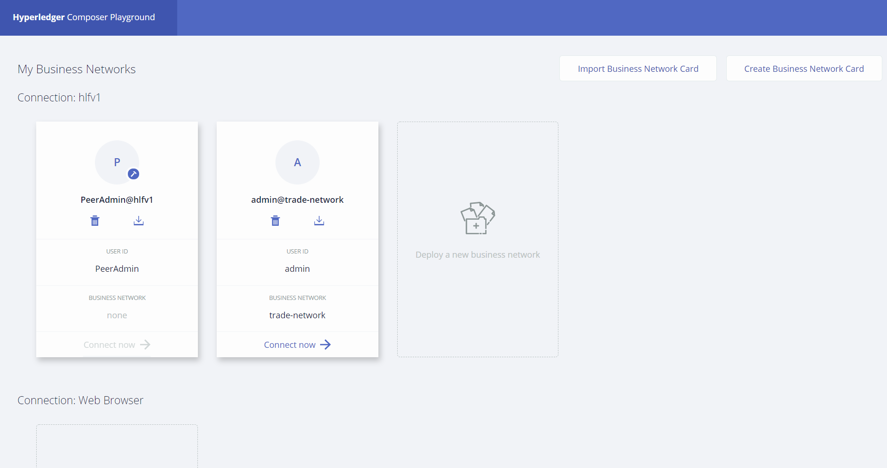
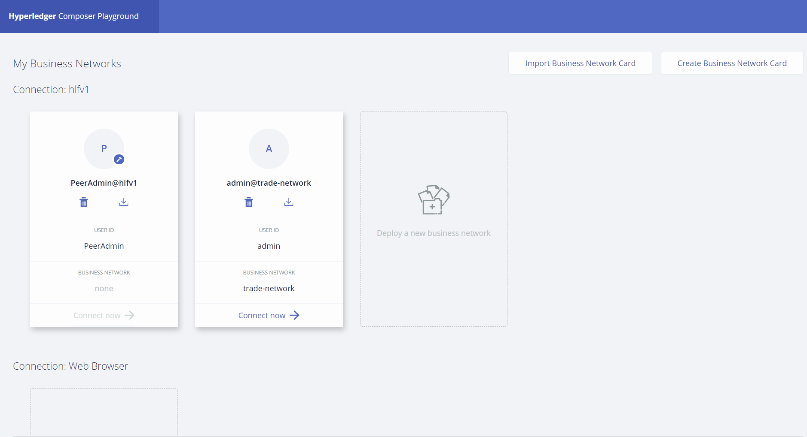
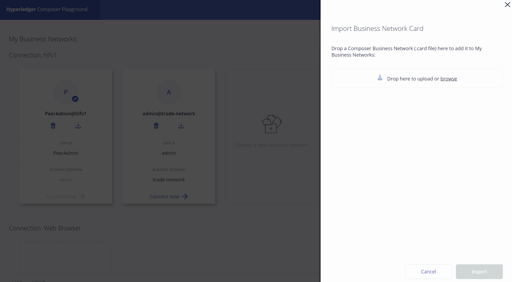

# IBM Blockchain Experience Day  
  
  
## 실습2 : Hyperledger Composer 설치 및 구성
********
  
## 실습 목표
본 실습은 블록체인 모델링 도구인 Hyperledger Composer를 설치하고 Hyperledger Fabric과 연동하는 과정을 단계별로 알아봅니다.  
Hyperledger Composer를 이용하면 사용자는 웹 인터페이스를 통해 보다 쉽게 데이터 구조와 비즈니스 로직을 정의할 수 있고 이를 Hyperledger Fabric으로 배포할 수 있습니다.  


## 사전 준비사항  
본 실습은 Lab01을 완료하여 현재 구동되고 있는 Hyperledger Fabric 블록체인 네트워크가 있음을 가정합니다.  

  
## Hyperledger Composer 설치  
본 실습에서는 Hyperledger Composer 0.16.5 버전을 이용합니다. 0.16.5 버전은 Hyperledger Fabric v1.x와 호환가능한 교재 작성일 현재 최신 버전의 Hyperledger Composer입니다.  

Hyperledger Composer Playground는 웹 기반에서 블록체인 비즈니스 모델을 쉽게 개발할 수 있도록 도와주는 UI 기반의 도구입니다.  
다음의 명령을 통하여 Hyperledger Composer Playground의 Docker 이미지를 다운로드하고 latest tag를 부여합니다.  
```
docker pull hyperledger/composer-playground:0.16.5
docker tag hyperledger/composer-playground:0.16.5 hyperledger/composer-playground:latest
```
  
추가로 Hyperledger Composer CLI와 Composer REST Server, Yeoman 기반의 코드 생성 툴을 인스톨합니다.  
```
npm install -g composer-cli@0.16.5
npm install -g composer-rest-server@0.16.5
npm install -g generator-hyperledger-composer@0.16.5
```
  
## Hyperledger Composer Playground 시작  
다음과 같은 명령으로 Hyperledger Composer Playground컨테이너를 시작합니다.  
```
docker run -p 8080:8080 -d hyperledger/composer-playground
```
  
정상적으로 컨테이너가 구동되었다면 다음의 포트로 웹 브라우저를 통해 접근 가능합니다.  
** (IP address는 자신에게 할당된 서버의 IP address를 사용하세요) **  
http://ipaddress:8080/  

  

## Hyperledger Fabric과 Hyperledger Composer 연계  
Hyperledger Composer에서 현재 구동되고 있는Hyperledger Fabric과 연결하기 위해서는 Business Network Card가 필요합니다. Business Network Card는 Hyperledger Fabric 블록체인 네트워크의 접속정보 및 Certificate (개인키 및 공개키) 정보가 포함되어 있습니다.  

먼저 Hyperledger Composer를 위한 디렉토리를 생성합니다.  
```
cd ~/blockchain-demo
mkdir fabric-composer
cd fabric-composer
mkdir org1
````
  
이전 실습에서 생성하였던 local-hyperledger/crypto-config 폴더 하위의 다음의 파일들을 새로 생성한 ~/fabric-composer/org1 폴더로 복사합니다.  
아래의 명령으로 해당 파일을 복사할 수 있습니다.  
```
cd org1
cp ~/blockchain-demo/local-hyperledger/crypto-config/peerOrganizations/org1.example.com/users/Admin@org1.example.com/msp/signcerts/Admin@org1.example.com-cert.pem .
```
  
아래의 명령으로 관리자 개인키 파일을 현재 디렉토리로 복사하십시오.  
```
cd ~/blockchain-demo/fabric-composer/org1
cp -r ~/blockchain-demo/local-hyperledger/crypto-config/peerOrganizations/org1.example.com/users/Admin@org1.example.com/msp/keystore/* .
```
  
첫번째 파일은 Admin 사용자의 공개키 파일이고 두번째 파일은 Admin 사용자의 개인키 파일입니다. xxx...xxx_sk 파일의 이름은 Hyperledger Fabric을 구동할 때 cryptogen 으로 생성한 인증서의 고유한 이름이므로 환경마다 각기 달라집니다.  
다음은 블록체인 네트워크의 접속정보를 포함하고 있는 connection.json 파일을 같은 폴더 내에 생성합니다. 아래의 파일 내용에서 <> 속에 해당하는 정보를 자신의 Hyperledger Fabric 정보로 교체하세요. (<,>는 제거)  
*** 자신의 PC에서 작성한 후 WinSCP를 통해 서버로 전송하는 것이 좀 더 쉬울 것입니다. ***

```
{
    "name": "hlfv1",
    "type": "hlfv1",
    "orderers": [
       { "url" : "grpc://<ipaddress>:7050"
       }
    ],
    "ca": { "url": "http://<ipaddress>:7054",
            "name": "ca.org1.example.com"
    },
    "peers": [
        {
            "requestURL": "grpc://<ipaddress>:7051",
            "eventURL": "grpc://<ipaddress>:7053"
        },
        {
            "requestURL": "grpc://<ipaddress>:8051",
            "eventURL": "grpc://<ipaddress>:8053"
        }
    ],
    "keyValStore": "/home/ubuntu/.composer-credentials",
    "channel": "composerchannel",
    "mspID": "Org1MSP",
    "timeout": "300"
}
```
  
이제 Business Network Card를 생성할 준비가 완료되었습니다.  
아래의 명령어로 Business Network Card를 생성합니다. 여기서 xxx...xxx_sk로 표시된 이름은 자신이 폴더에 복사한 개인키의 이름으로 바꾸어야 합니다.  
```
composer card create --file Admin.card --connectionProfileFile connection.json --user PeerAdmin --certificate Admin@org1.example.com-cert.pem --privateKey xxx...xxx_sk --role PeerAdmin --role ChannelAdmin
```
  
위의 명령이 성공적으로 실행되면 같은 폴더에 Admin.card라는 파일명의 Business Network Card가 생성될 것입니다. 이 파일을 이용하여 Hyperledger Composer Playground상에서 Connection을 생성하고 비즈니스 네트워크 모델을 생성할 수 있습니다.  
생성된 Business Network Card를 자신의 로컬컴퓨터에 다운로드 합니다. (sftp등 이용) 
그리고 브라우저를 열고 Hyperledger Composer Playground로 접근합니다.  
http://ipaddress:8080/  
아래의 그림과 같이 오른쪽 상단의 Import Business Network Card를 선택합니다.  
  
  
  
오른쪽 화면에서 browse를 클릭하여 다운받은 Admin.card를 선택합니다. 또는 탐색기에서 파일을 선택한 후 해당 공간에 드래그앤 드롭을 하여도 됩니다.  
  


