# IBM Blockchain Experience Day  
  
  
## 실습3 : Hyperledger Composer 모델링 실습  
********
  
## 실습 목표
본 실습은 Hyperledger Fabric 을 이용하여 블록체인 네트워크 환경을 구성하고 샘플 네트워크를 동작시키는 과정을 단계별로 알아봅니다. Hyperledger Fabric은 Linux Foundation산하의 open source 프로젝트로서 분산 원장 기술을 전 산업에 걸쳐 표준화하고 발전시키려는 목적으로 개발되고 있습니다.  

## 사전 준비사항  
  
본 실습은 Lab02를 완료하여 Hyperledger Fabric 블록체인 네트워크와 연동된 Hyperledger Composer가 구동되고 있음을 가정합니다.  

## Hyperledger Composer 모델링  

Hyperledger Composer Playground에서Business Network를 모델링할 경우에는 직접 구동되고 있는 Hyperledger Fabric과 연결하여 모델을 생성할 수도 있고 Web Browser의 Cache를 이용하여 모델 생성 후 차후에 Hyperledger Fabric 환경에 Deploy 할 수도 있습니다. 여기서는 Web Browser 연결로 새 Business Network을 생성하도록 하겠습니다.  

다음의 URL로 Hyperledger Composer Playground에 접근합니다.  
http://ipaddress:8080/  

화면 스크롤을 내려 Connection: Web Browser 하위의 Deploy a new business network를 선택합니다.  

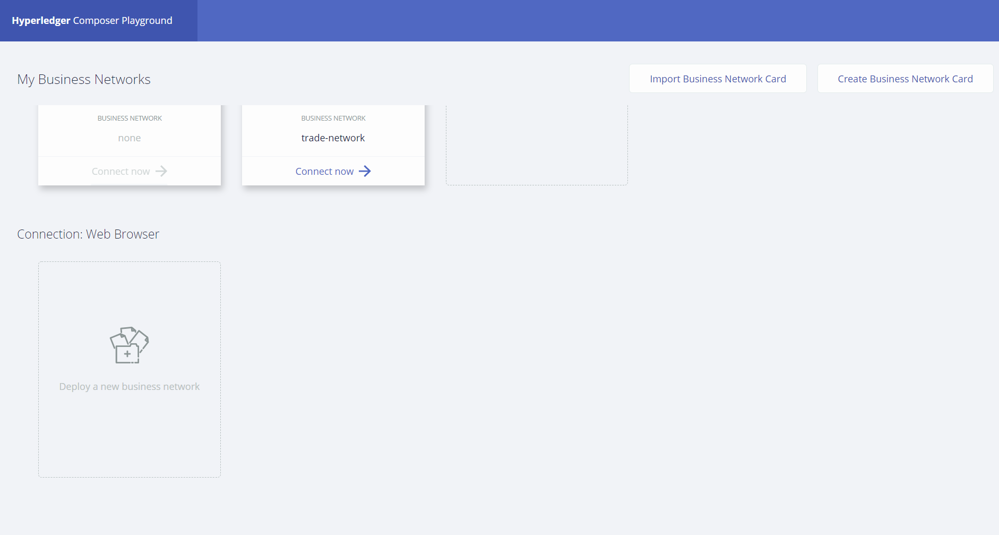  
  
다음과 같이 새로운 Business Network를 Deploy하는 화면이 나타납니다.  

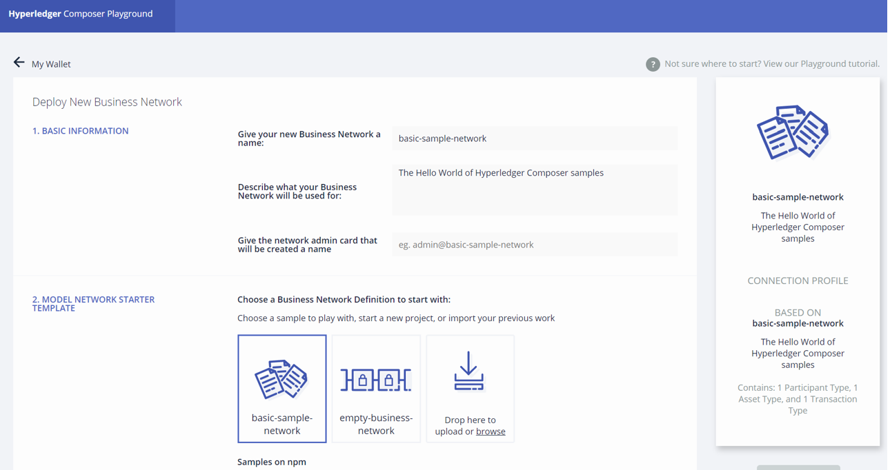  
  
Give your new Business Network a name 항목에 'tutorial-network'를 입력합니다.  

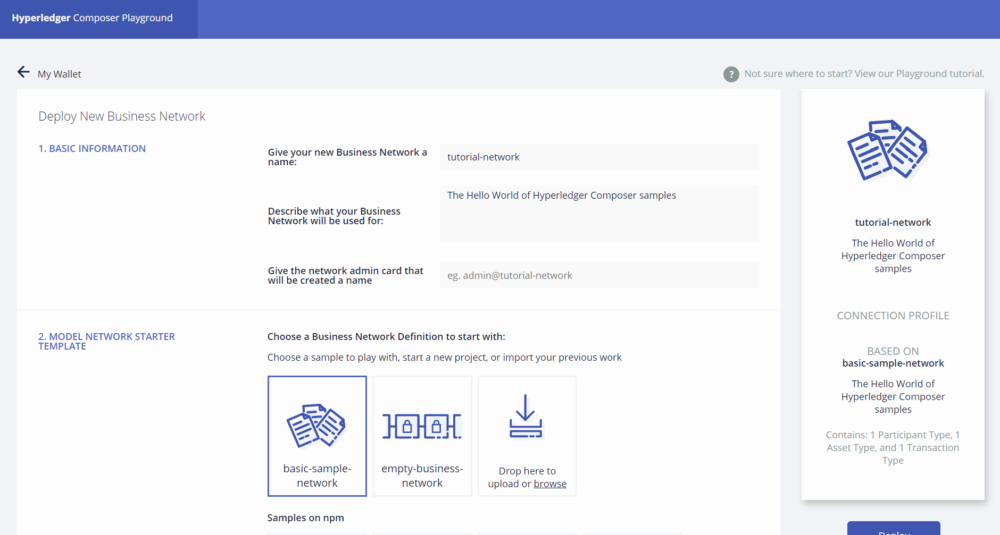  
  
아래쪽으로 스크롤하여 2. MODEL NETWORK STARTER TEMPLATE 하위의 empty-business-network를 선택합니다.  

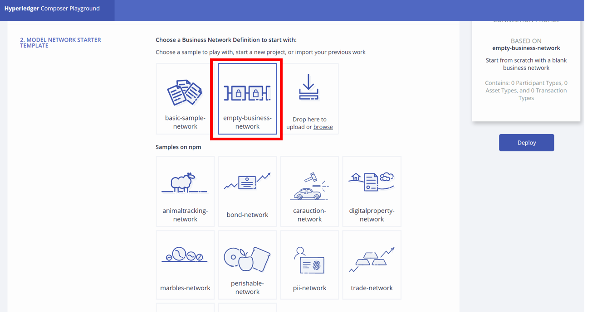  

Deploy 버튼을 클릭합니다.  

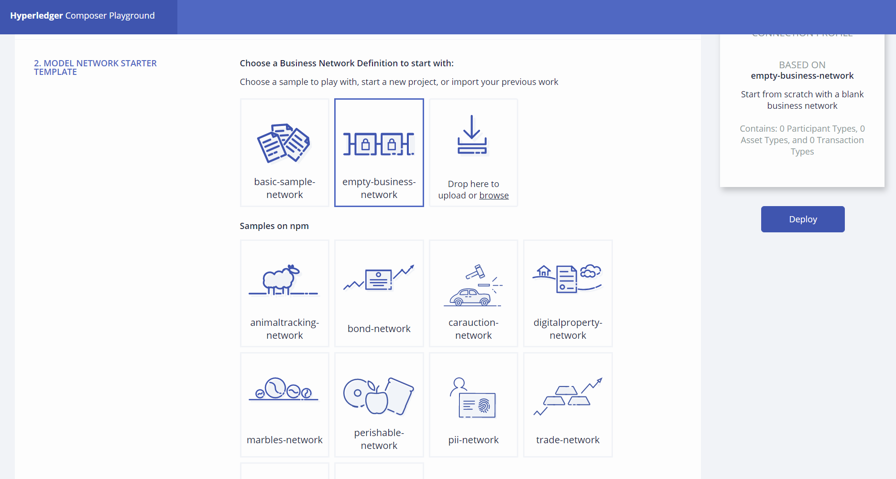  

Business Network가 성공적으로 배포되면 다음과 같이 admin@tutorial-network 사용자의 Business Network Card가 생성된 것이 보여질 것입니다.  

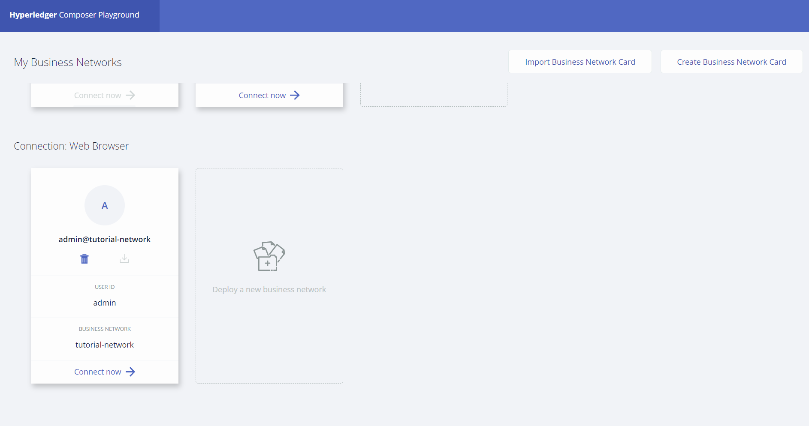  

Connect now를 클릭하여 모델링을 위한 인터페이스로 진입합니다.  

  

Blank 형식의 템플릿을 이용하였기 때문에 기본적으로 생성되어져 있는 것은 많지 않습니다.  

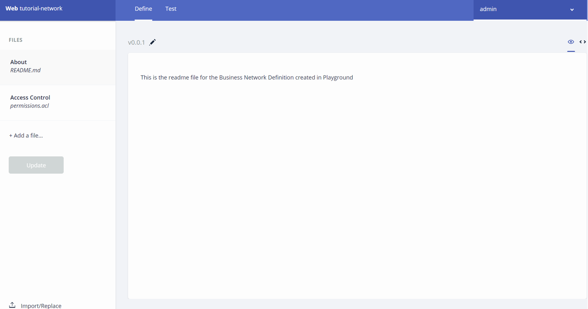  

화면에 보이는 것과 같이 현재는 Define 탭에 위치해 있습니다. Define탭에서는 비즈니스 네트워크를 모델링 할 수 있습니다. 가장 먼저 Model 파일을 생성해보도록 합니다. Model 파일은 블록체인 네트워크에서 거래될 자산과 참여자, 거래에 포함될 정보, 이벤트 등을 정의하는 파일입니다.  
Add a file 링크를 클릭합니다.  

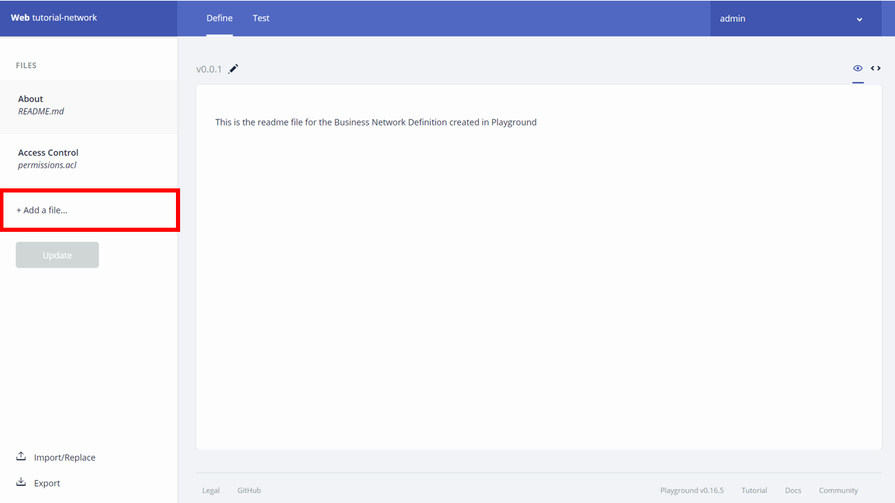  

Model File (.cto)를 선택하고 Add 버튼을 클릭합니다.  

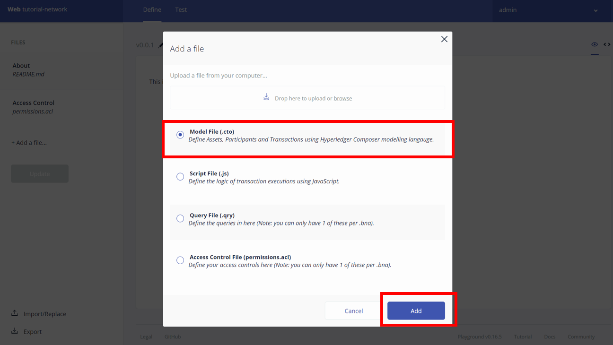  

다음과 같이 코드를 편집할 수 있는 화면이 나타납니다.  

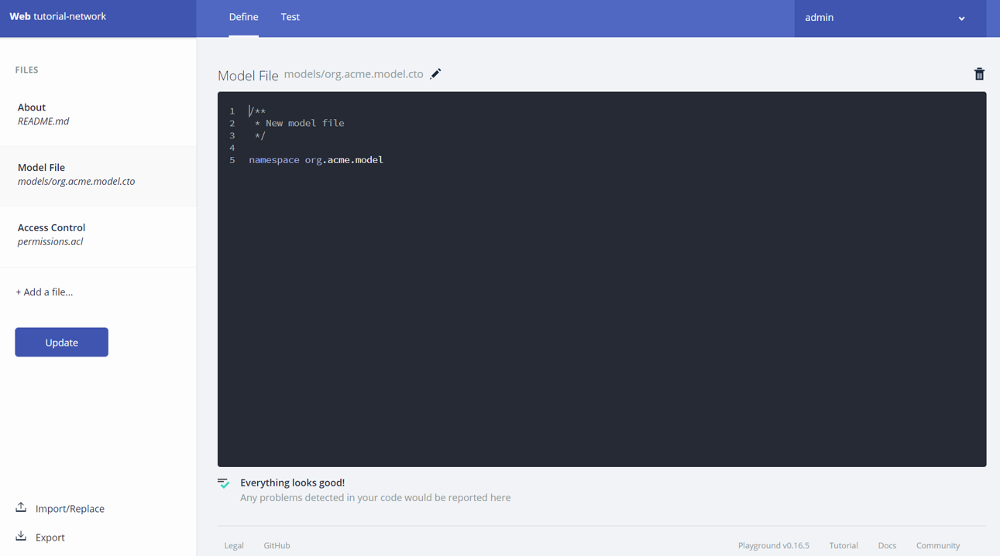  

기존의 코드를 지우고 다음의 코드를 복사하여 붙여넣습니다.  

```
/**
 * My commodity trading network
 */
namespace org.acme.trading
asset Commodity identified by tradingSymbol {
    o String tradingSymbol
    o String description
    o String mainExchange
    o Double quantity
    --> Trader owner
}
participant Trader identified by tradeId {
    o String tradeId
    o String firstName
    o String lastName
}
transaction Trade {
    --> Commodity commodity
    --> Trader newOwner
}
```  

예제의 모델은 Commodity라는 하나의 asset유형과 Trader라는 하나의 participant유형, 그리고 Trade라는 하나의 transaction 유형을 정의합니다. Hyperledger Composer 에서 모델은 cto라고 하는 고유의 문법으로 작성됩니다. 더 자세한 정보는 다음의 링크를 참조하세요.  
https://hyperledger.github.io/composer/latest/reference/cto_language.html  

다음은 transaction을 처리하기 위한 script 파일을 생성하도록 하겠습니다. Hyperledger Composer에서 transaction을 처리하는 script는 Java Script 형식으로 정의합니다. 위와 마찬가지로 Add a file 링크를 클릭합니다. 그리고 이번에는 Script file을 선택한 후 Add 버튼을 클릭합니다.  

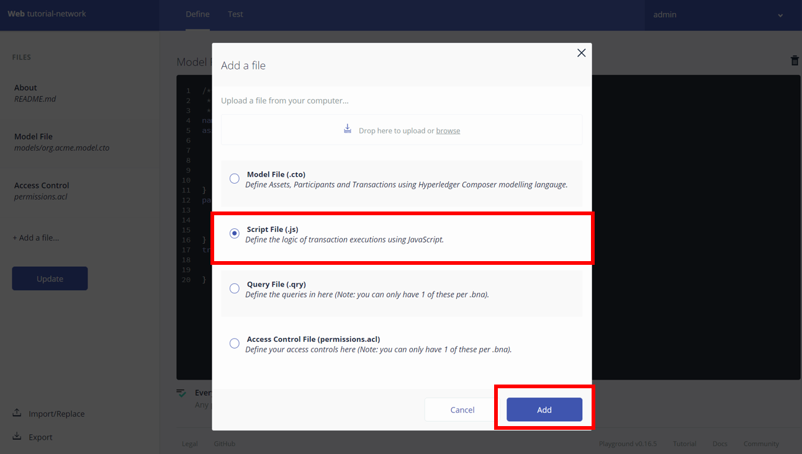  


