# IBM Blockchain Experience Day  
  
  
## 실습3 : Hyperledger Composer 모델링 실습  
********
  
## 실습 목표
본 실습은 Hyperledger Fabric 을 이용하여 블록체인 네트워크 환경을 구성하고 샘플 네트워크를 동작시키는 과정을 단계별로 알아봅니다. Hyperledger Fabric은 Linux Foundation산하의 open source 프로젝트로서 분산 원장 기술을 전 산업에 걸쳐 표준화하고 발전시키려는 목적으로 개발되고 있습니다.  

## 사전 준비사항  
  
본 실습은 Lab02를 완료하여 Hyperledger Fabric 블록체인 네트워크와 연동된 Hyperledger Composer가 구동되고 있음을 가정합니다.  

## Hyperledger Composer 모델링  

Hyperledger Composer Playground에서Business Network를 모델링할 경우에는 직접 구동되고 있는 Hyperledger Fabric과 연결하여 모델을 생성할 수도 있고 Web Browser의 Cache를 이용하여 모델 생성 후 차후에 Hyperledger Fabric 환경에 Deploy 할 수도 있습니다. 여기서는 Web Browser 연결로 새 Business Network을 생성하도록 하겠습니다.  

다음의 URL로 Hyperledger Composer Playground에 접근합니다.  
http://ipaddress:8080/  

화면 스크롤을 내려 Connection: Web Browser 하위의 Deploy a new business network를 선택합니다.  

  
  
다음과 같이 새로운 Business Network를 Deploy하는 화면이 나타납니다.  

  
  
Give your new Business Network a name 항목에 'tutorial-network'를 입력합니다.  

  
  
아래쪽으로 스크롤하여 2. MODEL NETWORK STARTER TEMPLATE 하위의 empty-business-network를 선택합니다.  

  

Deploy 버튼을 클릭합니다.  

  

Business Network가 성공적으로 배포되면 다음과 같이 admin@tutorial-network 사용자의 Business Network Card가 생성된 것이 보여질 것입니다.  

  

Connect now를 클릭하여 모델링을 위한 인터페이스로 진입합니다.  

  

Blank 형식의 템플릿을 이용하였기 때문에 기본적으로 생성되어져 있는 것은 많지 않습니다.  

  

화면에 보이는 것과 같이 현재는 Define 탭에 위치해 있습니다. Define탭에서는 비즈니스 네트워크를 모델링 할 수 있습니다. 가장 먼저 Model 파일을 생성해보도록 합니다. Model 파일은 블록체인 네트워크에서 거래될 자산과 참여자, 거래에 포함될 정보, 이벤트 등을 정의하는 파일입니다.  
Add a file 링크를 클릭합니다.  

  

Model File (.cto)를 선택하고 Add 버튼을 클릭합니다.  

  

다음과 같이 코드를 편집할 수 있는 화면이 나타납니다.  

  

기존의 코드를 지우고 다음의 코드를 복사하여 붙여넣습니다.  

```
/**
 * My commodity trading network
 */
namespace org.acme.trading
asset Commodity identified by tradingSymbol {
    o String tradingSymbol
    o String description
    o String mainExchange
    o Double quantity
    --> Trader owner
}
participant Trader identified by tradeId {
    o String tradeId
    o String firstName
    o String lastName
}
transaction Trade {
    --> Commodity commodity
    --> Trader newOwner
}
```  

예제의 모델은 Commodity라는 하나의 asset유형과 Trader라는 하나의 participant유형, 그리고 Trade라는 하나의 transaction 유형을 정의합니다. Hyperledger Composer 에서 모델은 cto라고 하는 고유의 문법으로 작성됩니다. 더 자세한 정보는 다음의 링크를 참조하세요.  
https://hyperledger.github.io/composer/latest/reference/cto_language.html  

다음은 transaction을 처리하기 위한 script 파일을 생성하도록 하겠습니다. Hyperledger Composer에서 transaction을 처리하는 script는 Java Script 형식으로 정의합니다. 위와 마찬가지로 Add a file 링크를 클릭합니다. 그리고 이번에는 Script file을 선택한 후 Add 버튼을 클릭합니다.  

  

기존의 코드를 지우고 다음의 코드를 복사하여 붙여넣습니다.  

```
/**
 * Track the trade of a commodity from one trader to another
 * @param {org.acme.trading.Trade} trade - the trade to be processed
 * @transaction
 */
function tradeCommodity(trade) {

    // set the new owner of the commodity
    trade.commodity.owner = trade.newOwner;
    return getAssetRegistry('org.acme.trading.Commodity')
        .then(function (assetRegistry) {
            // persist the state of the commodity
            return assetRegistry.update(trade.commodity);
        });
}
```  
위 스크립트는 transaction이 발생할 때 asset에 지정되어있던 owner를 새로운 owner로 변경합니다. 그리고 바뀐 asset(commodity)의 정보를 블록체인에 업데이트합니다.  

다음은 Access Control 파일의 내용을 살펴보도록 하겠습니다. Access Control 파일은 사전에 미리 생성이 되어 있습니다. 이 파일은 어떤 참여자가 어떤 상황에서 어떤 리소스에 접근할 수 있는지를 정의합니다.  

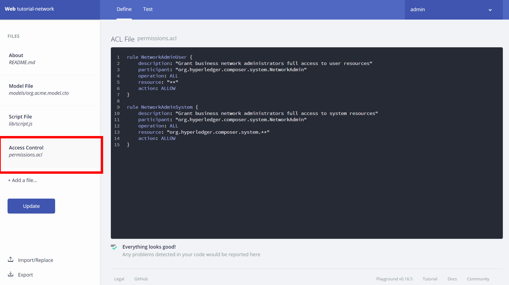  

Access Control 파일의 자세한 문법은 다음의 링크에서 확인할 수 있습니다.  
https://hyperledger.github.io/composer/latest/reference/acl_language.html  

필요한 파일들이 정의되었다면 이제 모델을 Deploy 할 준비가 된 것입니다. Update 버튼을 클릭하여 모델을 연결된 네트워크로 Deploy 합니다.  

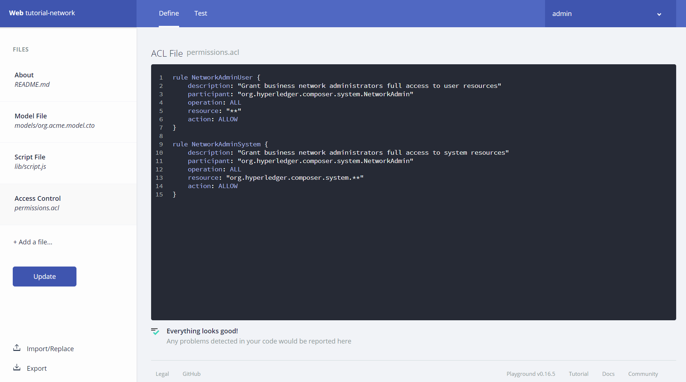  

모델이 배포되었다면 Test탭에서 transaction을 테스트 할 수 있습니다.  

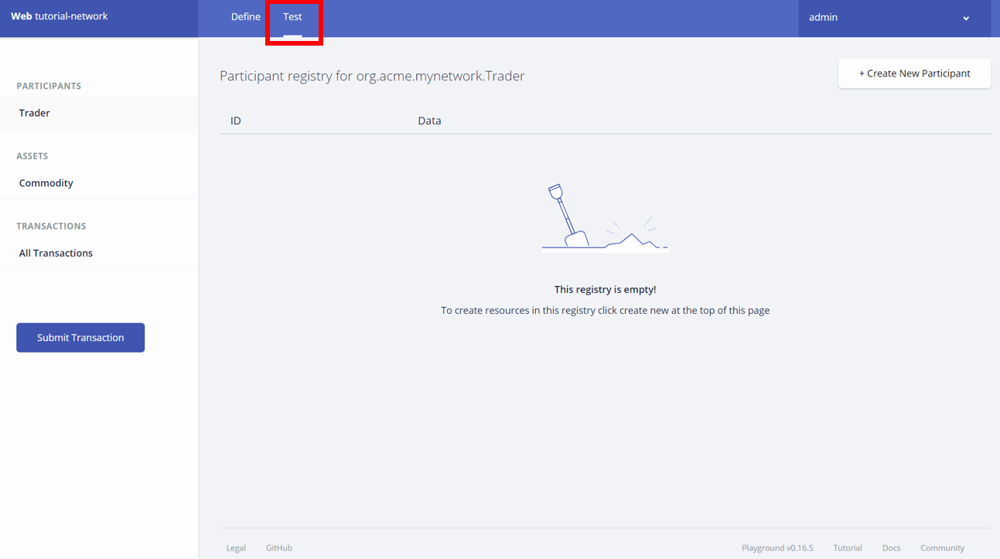  

왼쪽에 보여지는 것과 같이 우리가 Model.cto파일에서 정의하였던 participant와 asset의 리스트가 나타납니다. 현재는 participant에 Trader 라는 참여자 클래스가 정의되어 있고 asset에는 Commodity 라는 자산 클래스가 정의되어 있습니다.  

Trader에 대한 새로운 participant를 생성해 보겠습니다. Create New Participant 버튼을 클릭합니다.  

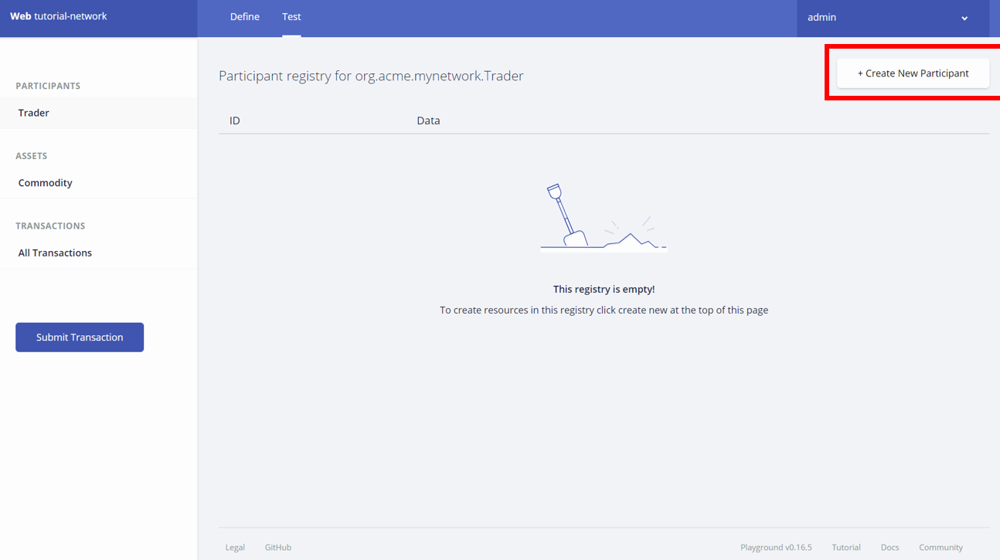  

기존의 코드를 삭제하고 아래의 코드를 복사하여 붙여넣게 합니다.  

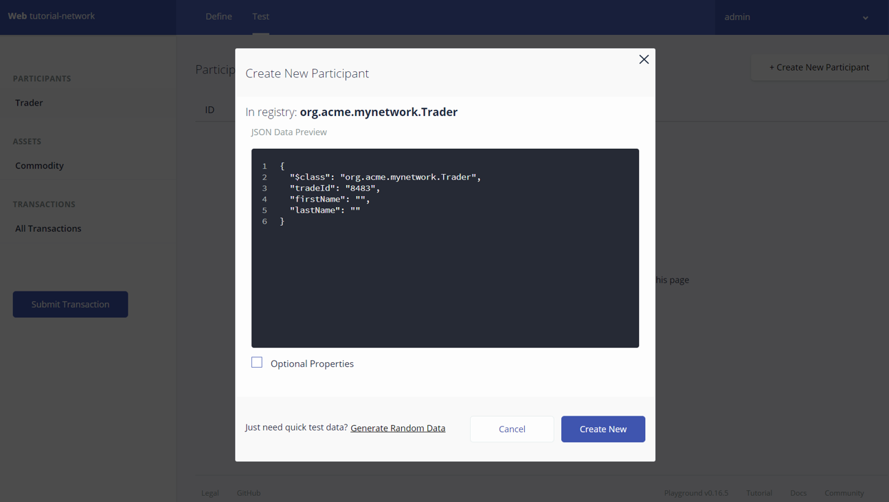  

```
{
  "$class": "org.acme.trading.Trader",
  "tradeId": "TRADER1",
  "firstName": "Jenny",
  "lastName": "Jones"
}
```  

그리고 Create New 버튼을 클리합니다.  

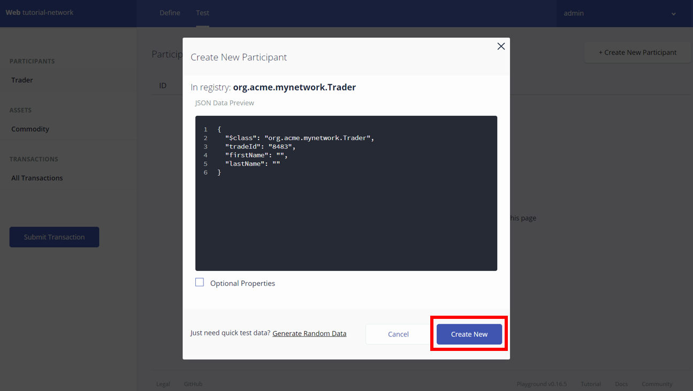  

다시 한번 동일하게 다음의 Trader를 새로 생성합니다.  

```
{
  "$class": "org.acme.trading.Trader",
  "tradeId": "TRADER2",
  "firstName": "Amy",
  "lastName": "Williams"
}
```

아래와 같이 TRADER1과 TRADER2가 생성된 것을 확인할 수 있을 것입니다.  

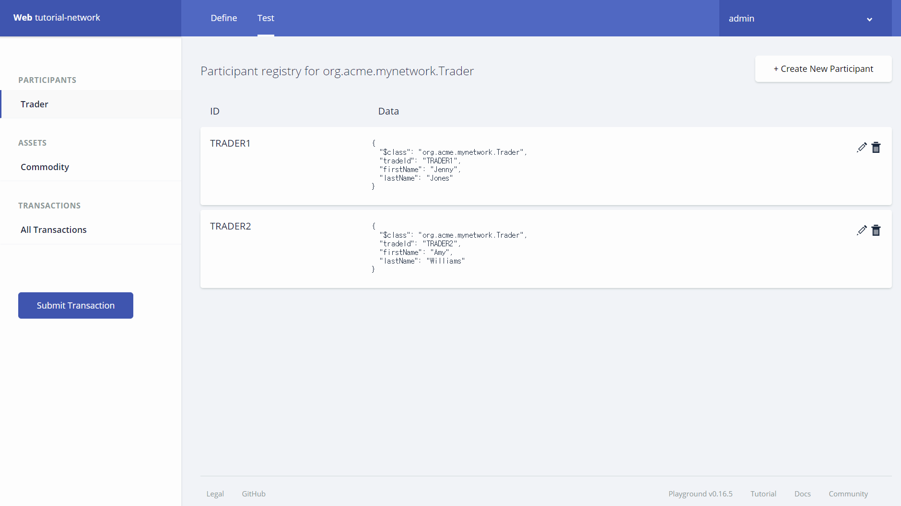  

Asset을 생성해보도록 하겠습니다. 좌측 ASSETS 하위의 Commodity를 클릭합니다.  

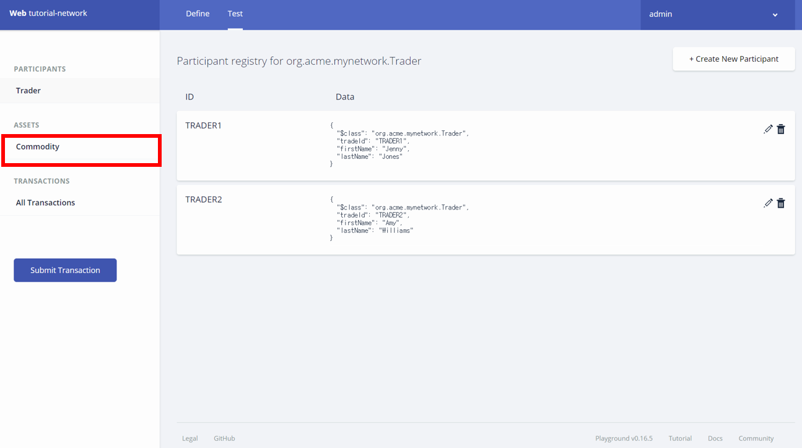  

이어 나타나는 화면에서 Create New Asset 버튼을 클릭합니다.  

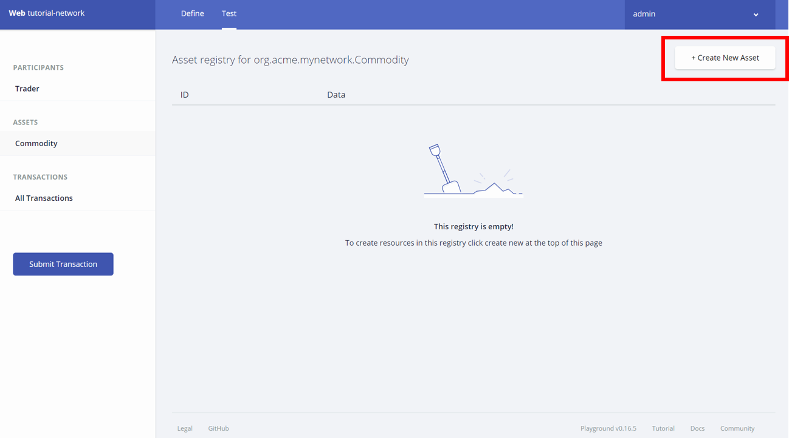  

기존의 코드를 삭제하고 아래의 코드를 복사하여 붙여넣게 합니다.  

```
{
  "$class": "org.acme.trading.Commodity",
  "tradingSymbol": "ABC",
  "description": "Test commodity",
  "mainExchange": "Euronext",
  "quantity": 72.297,
  "owner": "resource:org.acme.trading.Trader#TRADER1"
}
```

그리고 Create New 버튼을 클릭합니다. 소유자가 TRADER1인 commodity 유형의 asset이 생성되었습니다.  

  

마지막으로 생성된 asset의 소유권을 이전하는 transaction을 발생시켜 보도록 하겠습니다. 좌측의 Submit Transaction 버튼을 클릭합니다.  

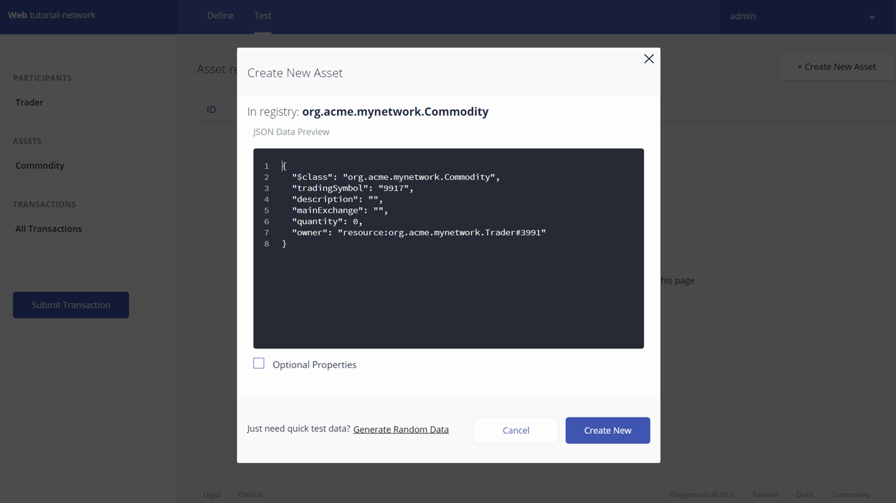  

기존의 코드를 삭제하고 아래의 코드를 복사하여 붙여넣게 합니다.  

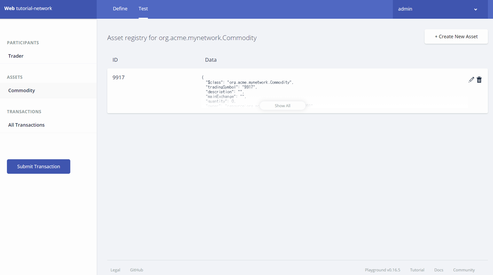  

```
{
  "$class": "org.acme.trading.Trade",
  "commodity": "resource:org.acme.trading.Commodity#ABC",
  "newOwner": "resource:org.acme.trading.Trader#TRADER2"
}
```

그리고 Submit 버튼을 클릭합니다. 이 transaction은 ABC라는 asset의 소유권을 TRADER1에서 TRADER2로 이전하는 비즈니스 로직을 수행합니다. 이에 해당하는 비즈니스 로직은 앞서 script.js파일에서 정의하였습니다.  

Transaction이 처리된 내역은 All Transactions에서 확인할 수 있습니다.  

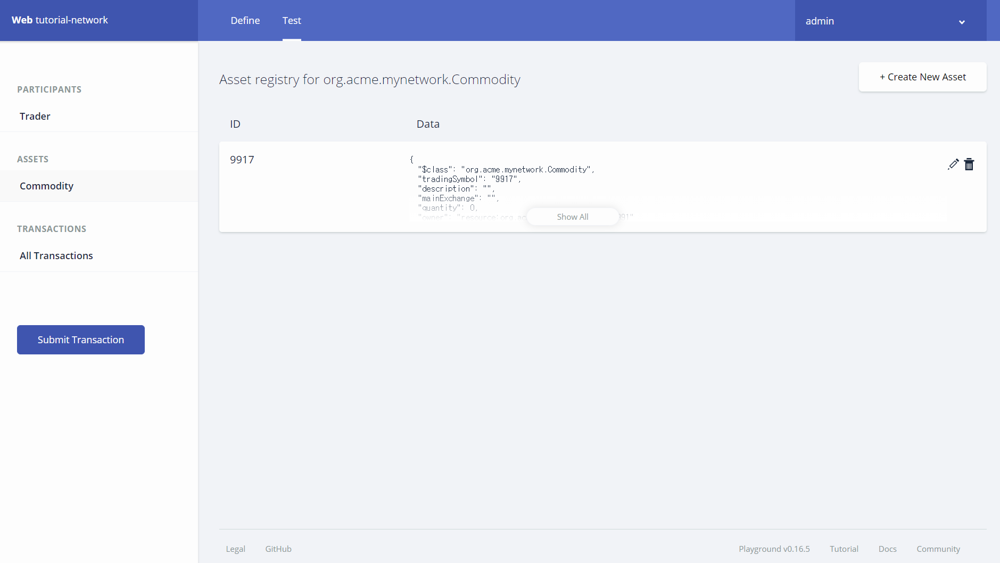  

이제 Commodity에 가서 ABC라는 심볼의 Commodity를 살펴보면 owner가 TRADER2로 변경된 것을 확인할 수 있을 것입니다.  

지금까지의 실습은 Hyperledger Fabric 블록체인에 연결하여 진행한 것이 아니라 웹브라우저의 캐쉬 시뮬레이션을 이용하여 모델링을 한 것이기 때문에 여기서 생성된 모델을 Hyperledger Fabric 블록체인 네트워크에 적용하기 위해서는 해당 모델을 Export하여 Hyperledger Fabric에 재배치 할 필요가 있습니다.  

Hyperledger Composer Playground에서는 생성된 모델을 Export할 수 있는 기능이 있습니다. 다음과 같이 Export 버튼을 클릭하여 모델을 다운로드 합니다.  

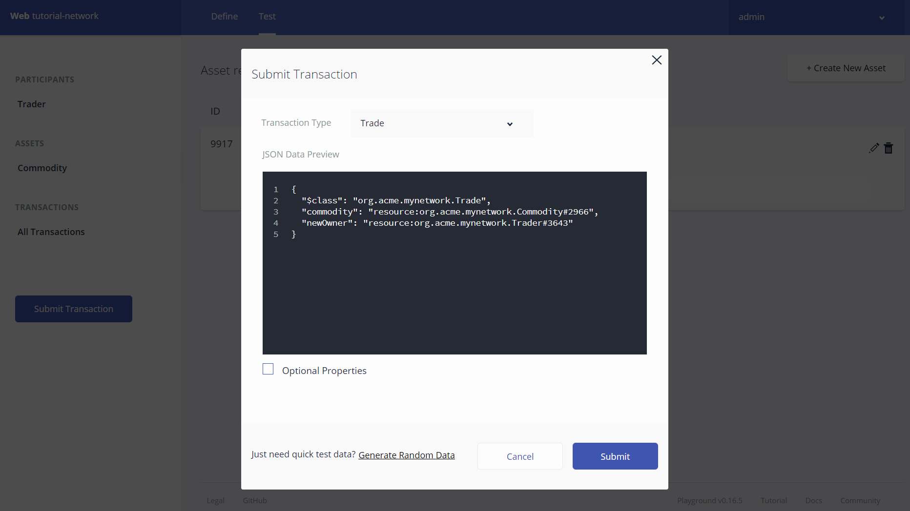  

다운로드된 파일은 bna 확장자 명을 갖게 되는데 이것은 Business Network Archive의 축약어입니다.  

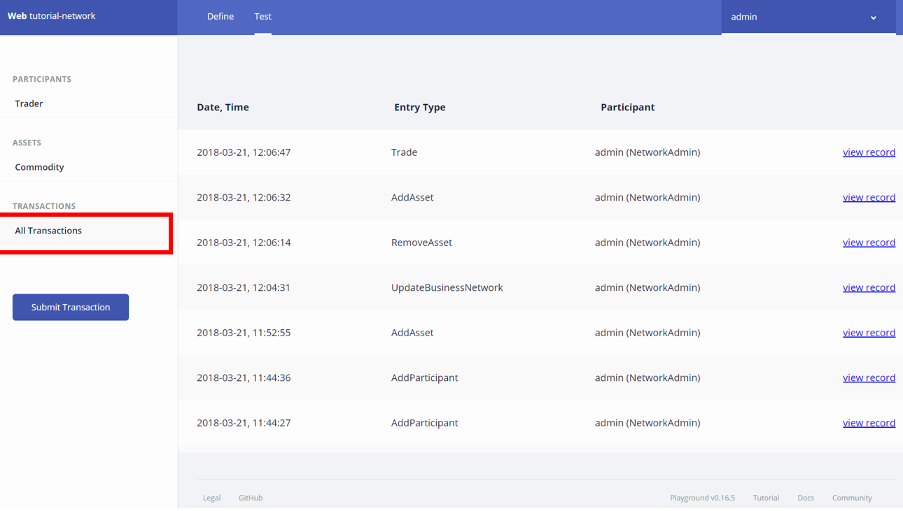  

이 bna파일이 있다면 Hyperledger Fabric 블록체인에 Deploy하는 과정을 거쳐 블록체인 네트워크에 적용할 수 있습니다.  

이상으로 실습3 을 완료하셨습니다. 수고하셨습니다.  


  


