# IBM Blockchain Experience Day  
  
  
## 실습4 : 블록체인 애플리케이션 개발
********
  
## 실습 목표
본 실습에서는 Hyperledger Fabric 블록체인 네트워크에 Hyperledger Composer로 모델링 된  비즈니스 네트워크를 배포하고 이와 통신하는 클라이언트 애플리케이션을 개발하는 과정을 수행합니다.   


## 사전 준비사항  
본 실습은 Lab03을 완료하여 배포 가능한 비즈니스 네트워크 모델 Archive 파일(.bna)을 가지고 있음을 가정합니다.  

  
## Business Network Archive를 이용한 모델 배포
Hyperledger Composer를 이용하여 생성한 비즈니스 네트워크 모델은 .bna 확장자 형태의 archive 파일로 다운받을 수 있습니다. 이미 Hyperledger Fabric에 연결된 connection 상에서 모델을 작성했다면 모델을 update 하는 동시에 모델링 된 비즈니스 네트워크가 Hyperledger Fabric에 즉시 적용되지만 Web Browser connection을 이용하였거나 해당 비즈니스 네트워크 모델을 다른 Hyperledger Fabric 블록체인에 적용할 때에는 .bna 파일을 이용하여 해당 Hyperledger Fabric에 배포할 수 있습니다.  
  
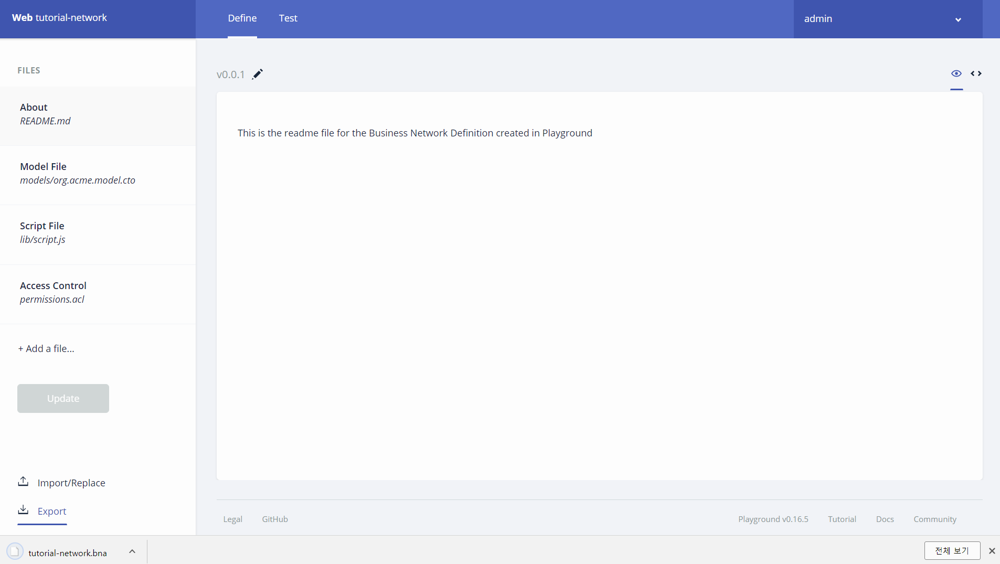  
  
Hyperledger Composer Playground의 Export 기능을 통해 tutorial-network.bna 파일을 다운로드 받습니다.  
  
Hyperledger Composer Playground 기본 화면으로 돌아가 My Business Networks 를 확인하십시오. PeerAdmin@hlfv1 은 자신의 서버로부터 가져 왔던 Business Network Card 입니다. 해당 카드 오른쪽의 Deploy a new business network 를 선택하여 새로운 Business Network를 생성합니다.  

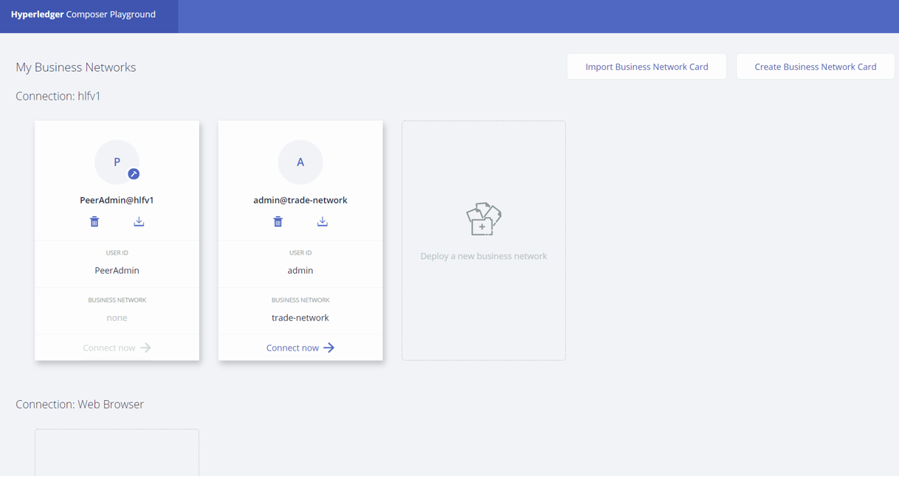  
  
다음과 같이 새로운 Business Network를 Deploy하는 화면이 나타납니다.  
  
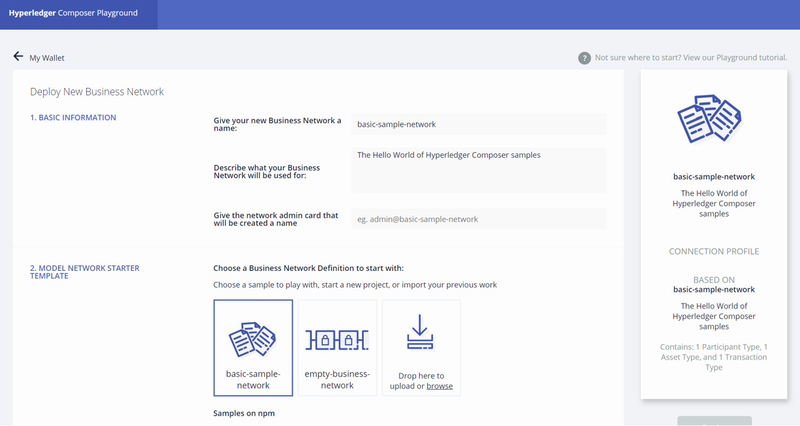  
  
Give your new Business Network a name: 항목에 trade-network 를 입력합니다.
아래쪽으로 스크롤하여 2. MODEL NETWORK STARTER TEMPLATE 하위에서 ‘Drop here to upload or browse’ 를 클릭합니다.  
  
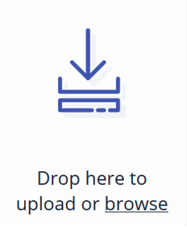  
  
자신이 생성하였던 tutorial-network.bna 파일을 선택하여 열기를 실행합니다.  
  
좀 더 아래쪽으로 스크롤 하여 3.CREDENTIALS FOR NETWORK ADMINISTRATOR 항목에서 ID and Secret를 선택합니다.  

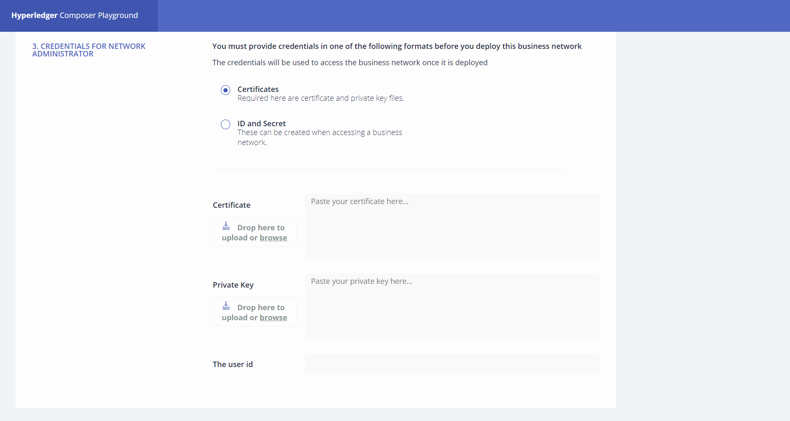  
  
ID and Secret을 선택한 후 보여지는 항목인 Enrollment ID와 Enrollment Secret에 *admin* 과 *adminpw* 를 각각 입력합니다.  
  
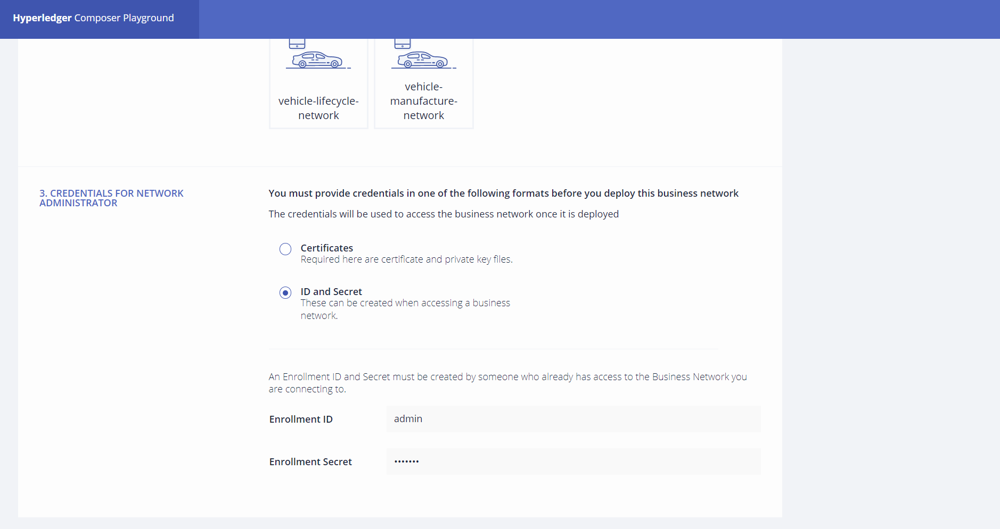  
  
그리고 상단으로 스크롤하여 Deploy 버튼을 클릭합니다.  
  
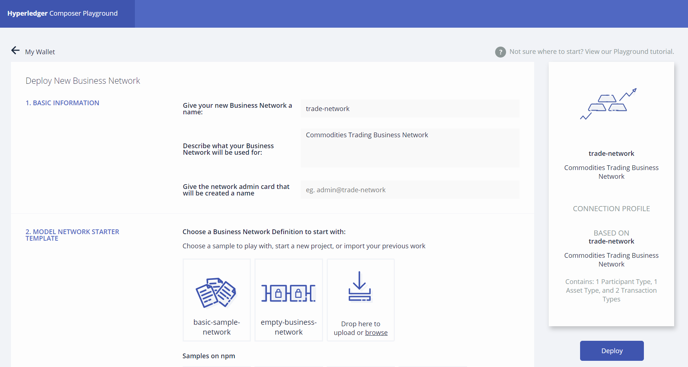  
  
Business Network가 성공적으로 배포되면 다음과 같이 admin@trade-network 사용자의 Business Network Card가 생성된 것이 보여질 것입니다.  
  
배포된 네트워크는 현재 동작하고 있는 Hyperledger Fabric에서 실행되며 해당되는 비즈니스 로직을 담고 있는 체인코드가 별도의 Container에서 동작하고 있는 상태입니다.
서버 콘솔에서 *docker ps* 명령어를 통하여 다음과 같은 체인코드 컨테이너를 확인할 수 있습니다.  
  
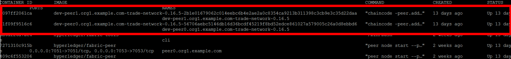  
  
웹 브라우저에서 해당 비즈니스 네트워크에 접속하기 위해서는 다시 Hyperledger Fabric에 business card를 import하는 과정을 거쳐야합니다. 아래와 같이 Hyperledger Composer Playground 웹 화면에서 새로 생성된 Business Network Card를 다운로드 합니다.  
  
  
  
다운로드 한 Business Network Card를 Hyperledger Fabric이 설치되어있는 서버의 다음 경로에 복사합니다.  
> ~/blockchain-demo/  
  
해당 경로로 이동하여 Business Network Card를 import합니다.  
  
```
cd ~/blockchain-demo
composer card import -f admin.card
```  
  
아래 명령을 이용하면 import된 Business Network Card를 모두 조회할 수 있습니다.  
  
```
composer card list
```  
  
이제 Hyperledger Composer Playground에서 Hyperledger Fabric과 연결된 비즈니스 네트워크 모델을 확인하고 Transaction을 테스트해 볼 수 있습니다.  
admin@trade-network 사용자의 Business Network Card에서 Connect now를 선택하여 비즈니스 모델링 화면으로 접근합니다.  

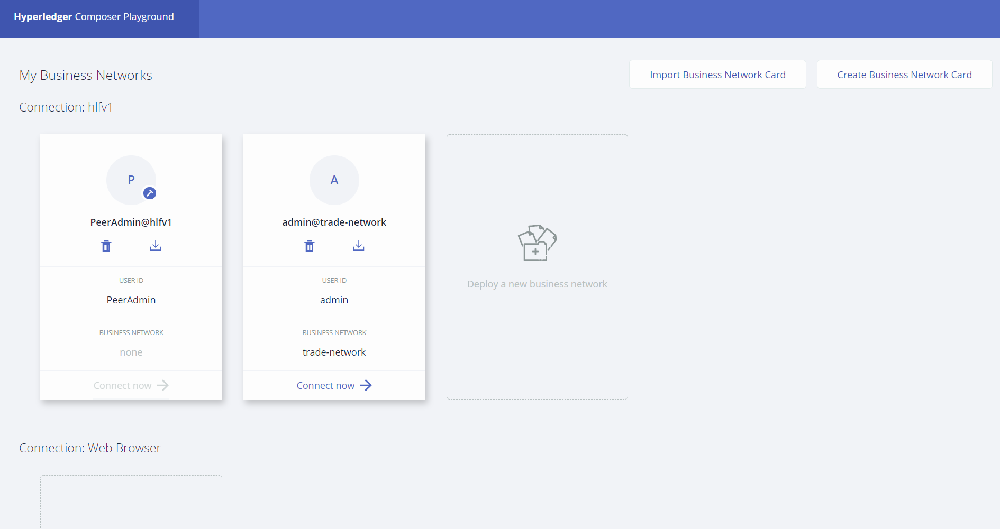  
  
다음과 같이 About, Model File, Script File, Access Control, Query File 등의 항목이 보여집니다.  
  
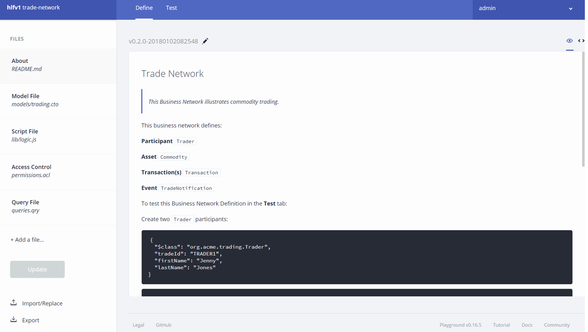  
  
상단의 Test를 클릭하면 Transaction을 전송하여 블록체인 네트워크를 테스트할 수 있습니다.  
  
  
  
  
## Fabric REST Server 구성  
  
Hyperledger Fabric 기반에서 동작하는 비즈니스 네트워크는 chaincode를 통해 데이터를 조회하고 입력합니다. 이기종 간의 통신을 원활하게 하기 위해서 언어와 플랫폼에 관계없이 서로 통신을 가능하게 하는 REST API를 구성하는 것이 좋습니다. Hyperledger Composer는 이러한 REST API를 자동으로 구성해주는 툴을 제공하고 있습니다.  
  
다음의 명령으로 tutorial-network 비즈니스 네트워크에 대한 REST 서버를 시작합니다.  
  
```
composer-rest-server -c admin@trade-network -n never -p 3001 &
```  
  
admin@trade-network.card 에는 Hyperledger Fabric에 대한 접속정보와 인증서가 포함되어 있습니다.  
  
다음의 URL로 접근하면 아래와 같은 REST API를 테스트할 수 있는 화면이 나타납니다.  
   
http://ipaddress:3001/  
   
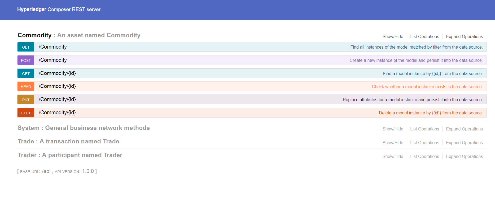  
  
기존에 정의한 Commodity, Trader, Trade 등의 asset과 participant, 그리고 transaction을 제어할 수 있는 API가 자동으로 생성되어 보여집니다.
아래와 같이 Trader를 추가해봅니다.  
  
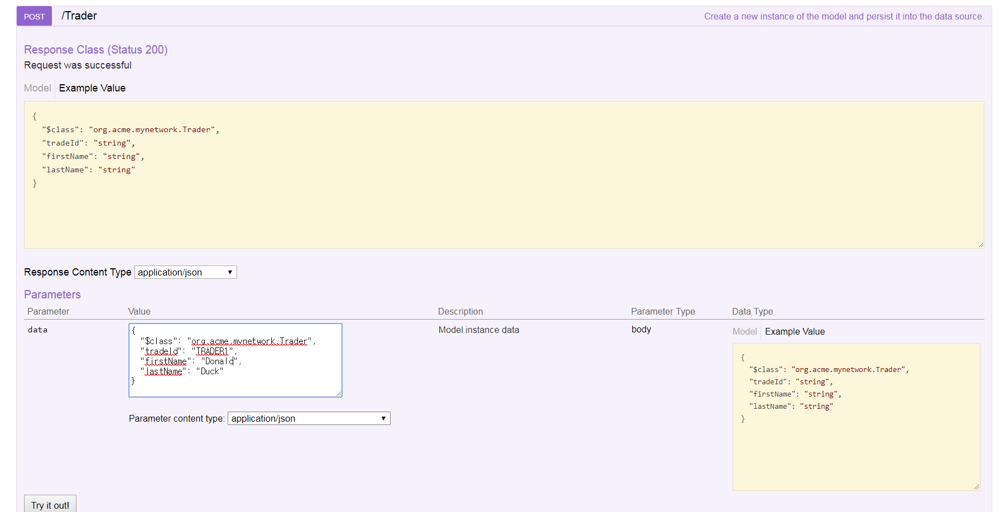  
  
```
{
  "$class": "org.acme.trading.Trader",
  "tradeId": "TRADER1",
  "firstName": "Donald",
  "lastName": "Duck"
}
```  
  
다음과 같은 결과를 얻으면 성공입니다.  
  
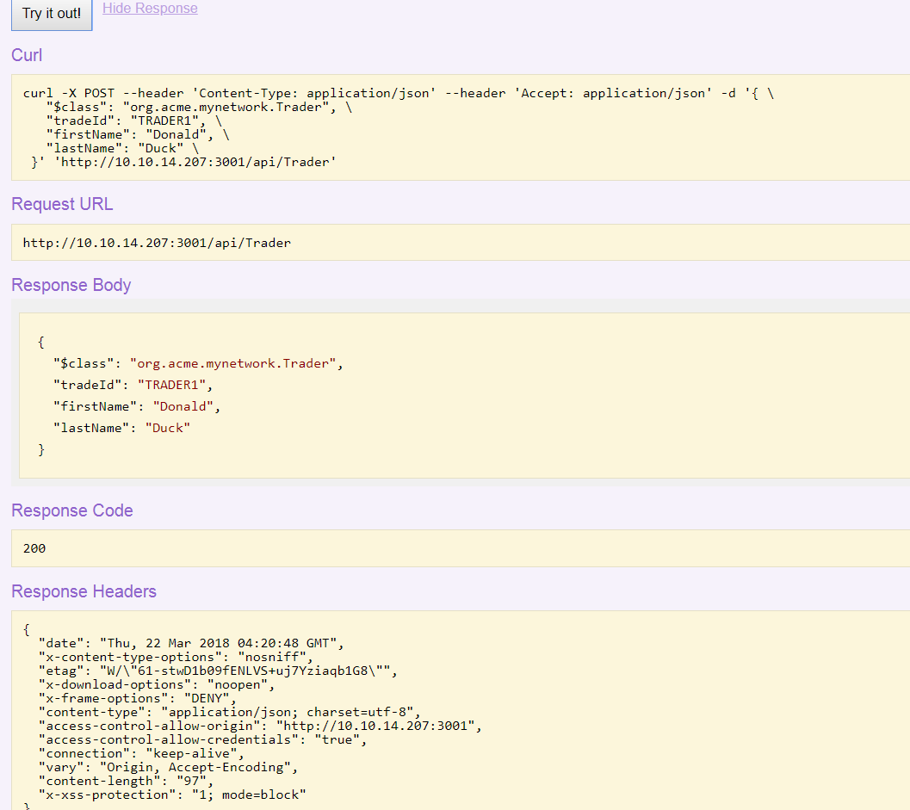  
  
Trader의 GET Method에서 Try it out! 버튼을 클릭하면 블록체인에 저장된 Trader의 정보를 조회할 수 있습니다.  
  
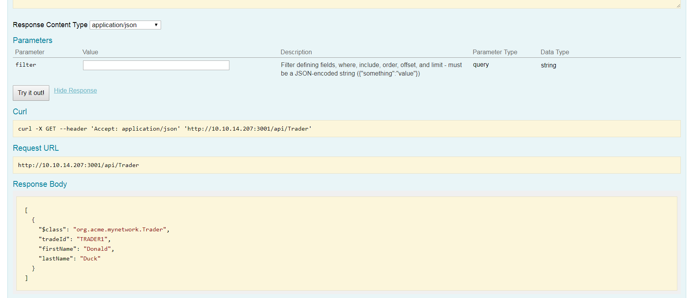  
  
## Blockchain Client 프로그램 실행  
  
Java, node.js 등의 클라이언트 프로그램에서 이 REST API를 호출함으로써 블록체인 네트워크와 통신할 수 있습니다.  
아래의 예시는 node.js로 샘플 애플리케이션을 구성한 화면입니다.  
  
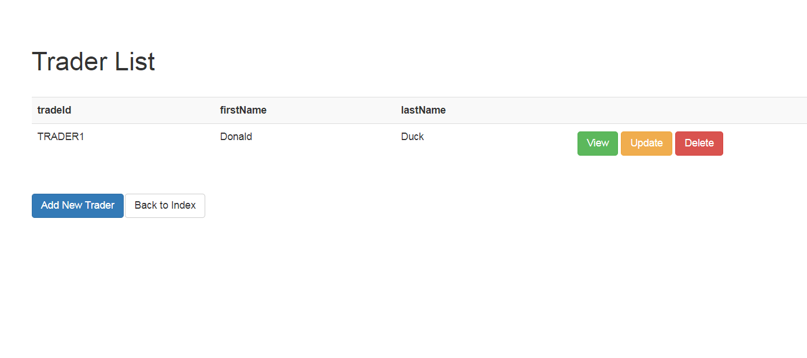  
  
브라우저의 REST API를 통해 입력한 Trader가 나타남을 확인할 수 있습니다.  
   
본 샘플 애플리케이션을 구동해보도록 하겠습니다.  
  
~/blockchain-demo/apps 하위 폴더에 trade-network-app 소스 디렉토리를 복사합니다. 
***(본 랩에서는 미리 복사되어 있습니다.)***  
본 애플리케이션은 node.js 언어로 프로그래밍 되어 블록체인 네트워크와 통신하는 샘플 애플리케이션입니다.  
   
애플리케이션의 디렉토리로 이동한 후 npm으로 필요한 모듈을 설치합니다.  
  
```
cd ~/blockchain-demo/apps/trade-network-app
npm install
```  
  
이 node.js 애플리케이션을 백그라운드로 구동하기 위하여 forever라는 node 모듈을 설치하도록 합니다. 모든 node.js 애플리케이션에서 사용 가능하도록 -g 옵션을 주어 전역으로 설치합니다.  
  
```
npm install -g forever
```  
  
에디터에서 ~/blockchain-demo/apps/trade-network-app 하위의 app.js 파일을 열어 17번째 라인을 편집합니다.  
  
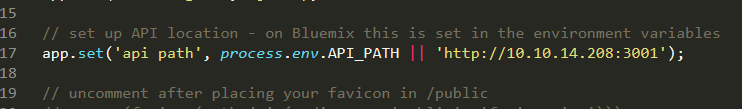  
  
위 코드는 REST 서버의 IP를 설정합니다. IP 주소를 자신의 서버 IP 주소로 변경합니다.  
  
아래의 명령으로 애플리케이션을 시작합니다.  
  
```
forever start bin/www
```  
  
웹 브라우저에서 다음의 경로로 접근할 수 있습니다.  
**http:// ipaddress:8001/**  
  
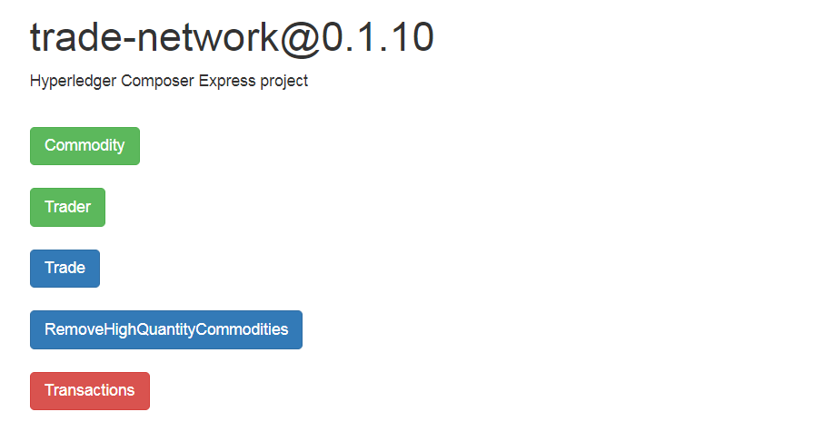  
  
Commodity와 Trader를 추가해보고 Trade 거래를 발생시켜보세요.  
  
## Hyperledger Explorer를 이용한 모니터링  
  
Hyperledger Explorer는 블록체인 네트워크를 모니터링 할 수 있는 오픈소스 모니터링 도구입니다. 현재 구동되고 있는 블록체인 네트워크를 살펴보기 위하여 Hyperledger Explorer를 실행해 보도록 하겠습니다.  
아래의 명령으로 blockchain-demo 폴더 하위에 blockchain-explorer를 다운로드 합니다.   
***(본 실습에서는 이미 다운로드 되어 있습니다.)***  
  
```
cd ~/blockchain-demo
git clone https://github.com/hyperledger/blockchain-explorer.git
```  
  
Hyperledger Explorer는 내부적으로 MySQL 데이터베이스를 사용하므로 해당 서비스를 인스톨해야 합니다.  
  
```
sudo apt-cache search mysql-server
sudo apt-get install mysql-server
```  
  
root의 패스워드는 **root** 로 설정합니다.  
  
MySQL 서비스를 시작합니다.  
  
```
service mysql start
```  
  
실행 시 요구에 따라 ubuntu 계정의 패스워드를 입력합니다.  
   

사용할 MySQL의 데이터베이스를 초기화합니다.  
  
```
cd ~/blockchain-demo/blockchain-explorer
mysql -uroot -p < db/fabricexplorer.sql
```  
  
실행 시 요구에 따라 DB 계정의 패스워드인 'root'를 입력합니다.  
  
npm으로 필요한 모듈을 설치합니다.  
  
```
npm install
```  
  
다음의 스크립트를 실행하여 Hyperledger Blockchain Explorer를 시작하도록 합니다.  
  
```
chmod 775 start.sh
./start.sh
```  
  
웹 브라우저를 통해 다음의 URL로 접근하면 Blockchain Explorer 화면을 볼 수 있습니다.  
**http:// ipaddress:9000/**  
  

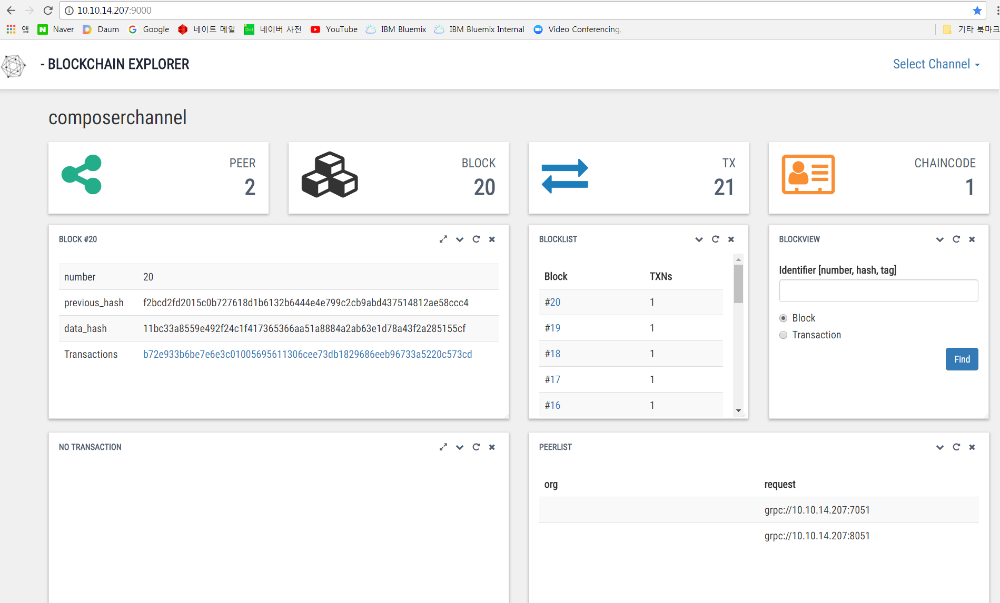  
  
현재까지 생성된 블록의 갯수, 특정 블록의 해쉬값 및 현재 리소스 사용상태 등을 모니터링 할 수 있습니다.  

이상으로 04 실습을 완료하셨습니다. 수고하셨습니다.  


  


